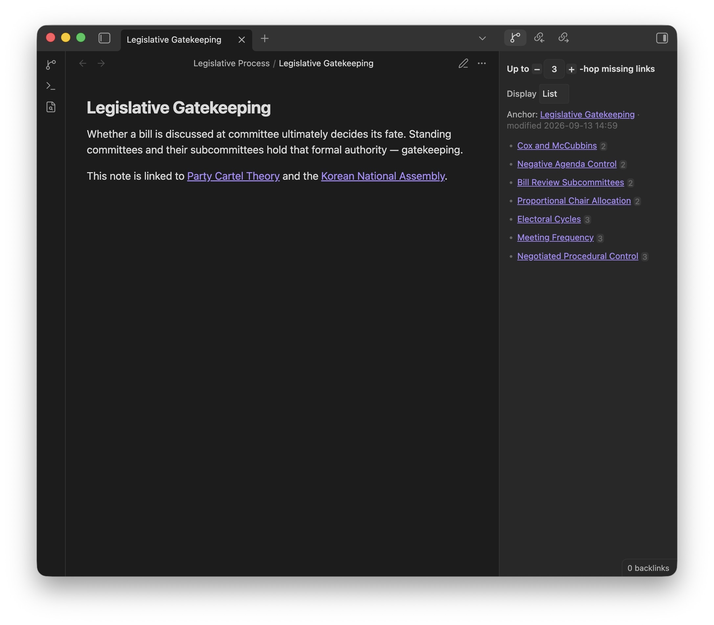
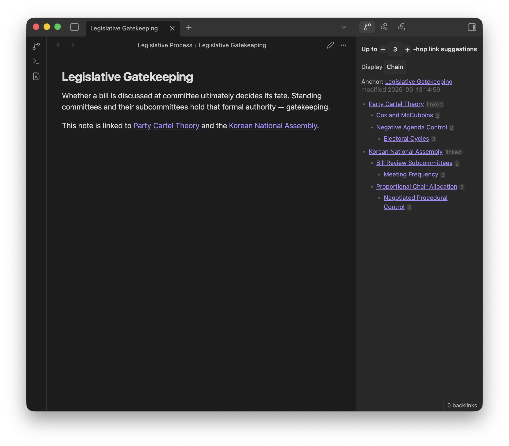

# Hop-Link Viewer — Obsidian Plugin

**Hop-Link Viewer** surfaces unlinked notes across your vault that are reachable through your existing connections. While Obsidian’s local graph view looks visually impressive, it can quickly become cluttered and unintuitive to refer to when writing your notes. **Hop-Link Viewer** provides a clean, text-first alternative. It shows notes that aren't yet linked to your current note, but are linked to notes that already are.

> **What’s new in 1.2.0.**
>
> You can now see the hop walk as a nested **Chain**, or keep the unique-note **List**. Direct links stay off in List and on in Chain so the path is visible. A PDF opened as its own tab can be the anchor. In a pop-out window, **Open viewer in sidebar** splits to the right of the note. [Full release notes](https://github.com/sunwookwak-polisci/Hop-Link-Viewer/releases/tag/1.2.0).

## What it does

Hop-Link Viewer starts from the note you are writing—the **anchor**—and walks outward through the links already in your vault. It lists nearby notes that are **not yet connected** to that anchor, but are connected to notes that already are.

A connection counts in either direction, treating backlinks and outlinks the same. In **List view**, already-linked neighbors (1-hop) stay hidden by default, so you see **missing** links instead of repeating what backlinks and outlinks already show. In **Chain view**, those neighbors are shown by default so you can see the path. Each suggestion is a clickable title with a hop number (2, 3, …) on the right, or a **linked** badge for a direct neighbor.

### Example

You are writing **Legislative Gatekeeping**, which already links to **Party Cartel Theory** and the **Korean National Assembly**.

| Distance | Meaning | In List View | In Chain View |
|----------|---------|------|-------|
| **1-hop** | Direct neighbors — Party Cartel Theory, Korean National Assembly | Hidden | Shown (`linked`) |
| **2-hop** | Linked from those neighbors, but not from Legislative Gatekeeping — e.g. **Cox and McCubbins**, **Bill Review Subcommittees** | Shown | Shown |
| **3-hop** | One step further — e.g. **Meeting Frequency**, **Negotiated Procedural Control** | Shown | Shown |

Those 2-hop and 3-hop notes are the missing links. They sit near the note you are writing, but you have not linked them to it yet. (You can raise hop depth to look farther—4, 5, 6 hops, and so on.)

**List view** shows each of those notes once, with its hop number:

- Cox and McCubbins — 2
- Negative Agenda Control — 2
- Bill Review Subcommittees — 2
- Proportional Chair Allocation — 2
- Electoral Cycles — 3
- Meeting Frequency — 3
- Negotiated Procedural Control — 3

**Chain view** nests the same walk so you can see the path. Direct neighbors are included by default and become the roots:

- Party Cartel Theory
  - Cox and McCubbins
  - Negative Agenda Control
    - Electoral Cycles
- Korean National Assembly
  - Bill Review Subcommittees
    - Meeting Frequency
  - Proportional Chair Allocation
    - Negotiated Procedural Control

## How to use

Open the viewer from the ribbon (**Open Hop-Link Viewer**) or the command palette (**Hop-Link Viewer: Open viewer in sidebar**). It follows your active note, walking through backlinks and outlinks.

Click or tap a suggestion to open it. On desktop, Ctrl/Cmd-click or middle-click opens a new tab. Use the hop-depth stepper at the top of the viewer to look nearer or farther. The list refreshes when you switch notes, edit links, or change hop depth. Suggestions are markdown notes and PDFs; images, canvases, and other attachments are skipped even if they are linked.

To keep the list beside your writing, use **Open viewer below active note** or **Open viewer to right of active note**. You can **Link with tab** so that pane follows a specific note; otherwise it follows the active file in the same window.

**List** (the default) shows each nearby note once and hides direct links. **Chain** nests suggestions along the paths that reached them, including direct links so you can see *how* a note sits next to the one you are writing. Switch styles from the **Display** control in the viewer or with **Hop-Link Viewer: Cycle display style**. Each style has its own **Include direct links** toggle.

> Typical uses: spotting a related note while drafting, finding the “obvious in hindsight” link between two clusters, or raising hop depth to wander a little farther.

### Options

These settings live under **Settings → Hop-Link Viewer**, grouped to match the settings tab. The hop-depth stepper and Display control in the viewer change the same values.

| Setting | Default | What it does |
|---------|---------|--------------|
| **Display style** | List | **List** shows each nearby note once. **Chain** shows nested walks and may repeat a note that sits on more than one path. |
| **Hop depth** | `3` | How far to walk from the current note. Hop 1 appears only when that style includes direct links. |
| **Display cap** | `15` | How many notes List shows, or how many top-level rows Chain shows. |
| **Nested list cap** | `5` | For Chain only, how many items each nested list (second level and deeper) shows. List is unchanged. |
| **List order** | Walk order | Sort before the display cap and nested list cap are applied. Walk order follows discovery; you can also sort by modified time, link count, title, or shuffle. |
| **Anchor mode** | Active file | Which file is “you are here”: the active markdown or PDF, the last file you edited, or the last one you viewed. |

**Direct links**

| Setting | Default | What it does |
|---------|---------|--------------|
| **List** | off | Also list notes already connected to the anchor. Those rows show a **linked** badge. |
| **Chain** | on | Also list notes already connected to the anchor, in Chain. On by default so the walk can start from notes you already linked. |

**Folders**

| Setting | Default | What it does |
|---------|---------|--------------|
| **Excluded folder paths** | _(empty)_ | Hide those folders from the list. Notes there can still be the anchor, and the walk can still pass through them. |

**Startup**

| Setting | Default | What it does |
|---------|---------|--------------|
| **Auto-open sidebar on startup** | off | Open the viewer when Obsidian starts. |

The anchor can be a markdown note or a PDF opened as its own tab. If none can be resolved, the viewer shows “No anchor found.”

## Install

Requires Obsidian 1.13.0 or newer.

1. Open **Settings → Community plugins**.
2. Turn off **Restricted mode** if it is on.
3. Click **Browse**, search for **Hop-Link Viewer**, then install and enable it.

## License

MIT — see [LICENSE](LICENSE).

See [CONTRIBUTING.md](CONTRIBUTING.md) for development setup and pull requests.
