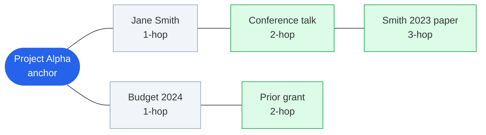

# Hop-Link Viewer — Obsidian Plugin

Suggest wiki-linked notes **up to N hops** from an **anchor note**, excluding notes already directly linked to the anchor (unless enabled). Built for serendipitous discovery of "missing" network links in your vault.

## What it does

**Hop-Link Viewer** opens a sidebar that answers one question: *Given the note I'm focused on right now, what other notes in my vault are nearby in the link graph — but not yet connected to it?*

Obsidian already knows how your notes link together. This plugin walks that network outward from a starting note (the **anchor**) and lists candidates worth opening. By default it skips notes you have **already linked** to the anchor, so the list highlights **gaps** in your graph rather than repeating backlinks you can already see.

### A concrete example

Say your anchor is **Project Alpha**. It links directly to **Jane Smith** and **Budget 2024**.

| Distance | Meaning | Shown by default? |
|----------|---------|-------------------|
| **1-hop** | Notes Project Alpha links to (or that link to it) — Jane, Budget | No — you already know these |
| **2-hop** | Notes linked from Jane or Budget, but not from Project Alpha — e.g. **Conference talk**, **Prior grant** | Yes |
| **3-hop** | Notes one step further out — e.g. a paper cited on Conference talk | Yes (up to your hop depth setting) |



**Legend:** blue = anchor · gray = already linked to anchor (hidden by default) · green = missing-link suggestions in the sidebar (hop 2+)

Each suggestion in the sidebar is clickable. Notes show a small **hop number** (2, 3, …) so you can tell how far they sit from the anchor. Turn on **Include direct links** if you also want 1-hop neighbors listed — those appear with a **linked** badge instead.

### What you see in the sidebar

1. **Hop depth control** — stepper and number field (e.g. "Up to **3**-hop missing links"); changes persist and sync with Settings
2. **Anchor** — the note suggestions are centered on, with last-modified time
3. **Suggestion list** — up to your display cap (default 10), each a wiki link you can open in the same pane or a new tab

The sidebar **updates on its own** when you switch notes, open files, save edits, or when Obsidian refreshes link metadata. No refresh button, no query to write.

### How the anchor is chosen

The anchor is whatever note the plugin treats as "you are here." In **Settings → Hop-Link Viewer** you pick:

- **Active file** (default) — the note in your focused editor pane
- **Last edited** — the markdown file you most recently saved
- **Last viewed** — active file when possible; otherwise your most recently opened note

That makes the sidebar follow your workflow: stay on the current note while writing, or drift toward whatever you touched last across the vault.

### What gets filtered out

Suggestions never include the anchor itself. By default, direct neighbors are hidden too. You can also exclude whole folder prefixes so routine journals don't flood the list — excluded folders affect **suggestions only**; they don't stop those notes from being anchors or from being traversed on the way to deeper hops.

Supported suggestion types: markdown notes, extensionless note paths, and PDFs linked in the graph.

### Typical ways people use it

- **While writing a project or literature note** — spot related concepts two or three links away that you forgot to mention or connect
- **During daily review** — with *last edited* anchor mode, see what's adjacent to whatever you worked on most recently
- **Graph hygiene** — periodically discover "obvious in hindsight" links between clusters of notes
- **Exploration without search** — shuffle sort order or raise hop depth when you want a random walk through nearby ideas instead of keyword lookup

No Dataview, no query language, no template setup. Enable the plugin, open the sidebar (ribbon icon or command palette → **Hop-Link Viewer: Open viewer**), and work as usual.

## Why use it

Your vault is a network of ideas — but day to day you mostly see the links you already made. **Hop-Link Viewer** surfaces notes that sit *near* your current focus yet remain unconnected.

It is built for **serendipity on demand**: an always-ready sidebar that nudges you toward relevant notes you might otherwise never open.

**Good fit if you:**

- Maintain a large or fast-growing vault and feel "there should be a note for this somewhere"
- Want gentle prompts to strengthen your knowledge graph without opening the global graph view
- Work from a daily note, project hub, or literature note and need related context at a glance
- Prefer discovery over search — following the shape of your links rather than typing keywords

## Install via BRAT (recommended for beta)

Requires Obsidian 1.13.0 or newer.

1. Install the [BRAT](https://github.com/TfTHacker/obsidian42-brat) plugin from Obsidian Community plugins.
2. Open **Settings → BRAT** → **Add Beta plugin**.
3. Enter the repository:
   ```
   sunwookwak-polisci/Hop-Link-Viewer
   ```
4. Enable **Hop-Link Viewer** under Community plugins.

BRAT installs from the [GitHub release](https://github.com/sunwookwak-polisci/Hop-Link-Viewer/releases) (`main.js`, `manifest.json`, `styles.css`). Use **Check for updates** in BRAT to pull new versions.

## Install (manual)

1. Copy this folder into your vault's plugins directory:
   ```
   .obsidian/plugins/hop-link-viewer/
   ```
2. From the plugin folder, install dependencies and build:
   ```bash
   npm install
   npm run build
   ```
3. Enable **Hop-Link Viewer** in Obsidian → Settings → Community plugins.

## Usage

- Click the **git-branch** ribbon icon, or run **Hop-Link Viewer: Open viewer** from the command palette.
- The sidebar shows an anchor note and suggested links from hop 2 up to N (non-direct by default).
- Suggestions exclude the anchor, its direct neighbors, and paths under configured excluded folders.

The sidebar refreshes automatically when you switch notes, open files, save changes, or when the link graph updates.

## Settings

| Setting | Default | Description |
|---------|---------|-------------|
| **Hop depth** | `3` | Maximum hop distance; includes hop 2…N (hop 1 only with Include direct links) |
| **Display cap** | `10` | Maximum number of suggestions shown |
| **Excluded folder paths** | _(empty)_ | One prefix per line; hidden from suggestions only (anchors still allowed) |
| **Sidebar anchor mode** | `active-file` | How the anchor note is chosen (see below) |
| **List order** | `walk-order` | How suggestions are sorted before the display cap is applied |
| **Include direct links** | off | Also show 1-hop neighbors; marked with a `linked` badge |
| **Auto-open sidebar on startup** | off | Open the sidebar when Obsidian starts |

### Anchor modes (sidebar)

| Mode | Behavior |
|------|----------|
| `active-file` | The note in the focused pane |
| `last-edited` | Most recently modified markdown file (by `mtime`), excluding configured paths |
| `last-viewed` | Active file if valid; otherwise the first valid entry in recently opened files |

## How it works

1. Pick an anchor note based on the selected anchor mode.
2. Build an undirected link graph from inlinks and outlinks via `metadataCache`.
3. Walk up to N hops from the anchor (breadth-first by hop distance).
4. Include notes at hop 2 through hop N. Hop 1 (direct neighbors) are excluded unless **Include direct links** is on.
5. Filter out the anchor and excluded paths from suggestions. Excluded folders do not block anchor selection or traversal. Direct neighbors are hidden by default; enable **Include direct links** to show them with a `linked` badge.

No ranking beyond the chosen **List order** setting — sort the full candidate set, then apply the display cap.

### List order options

| Option | Behavior |
|--------|----------|
| `walk-order` | Order from the graph walk (default) |
| `mtime-desc` | Most recently modified first |
| `mtime-asc` | Oldest modified first |
| `link-count-desc` | Notes with the most vault links first |
| `alphabetical` | Note title A–Z |
| `random` | Shuffled on each refresh |

## Development

```bash
npm install
npm run dev    # watch mode
npm run lint   # official Obsidian and type-aware checks
npm run build  # production bundle → main.js
```

### Project layout

```
manifest.json   Plugin metadata
main.ts         Plugin entry point
styles.css      Sidebar styles
src/
  anchor.ts     Anchor resolution (active / last-edited / last-viewed)
  graph.ts      Link graph traversal and filtering
  view.ts       Sidebar ItemView
  settings-tab.ts
  constants.ts
```

## License

MIT — see [LICENSE](LICENSE).
